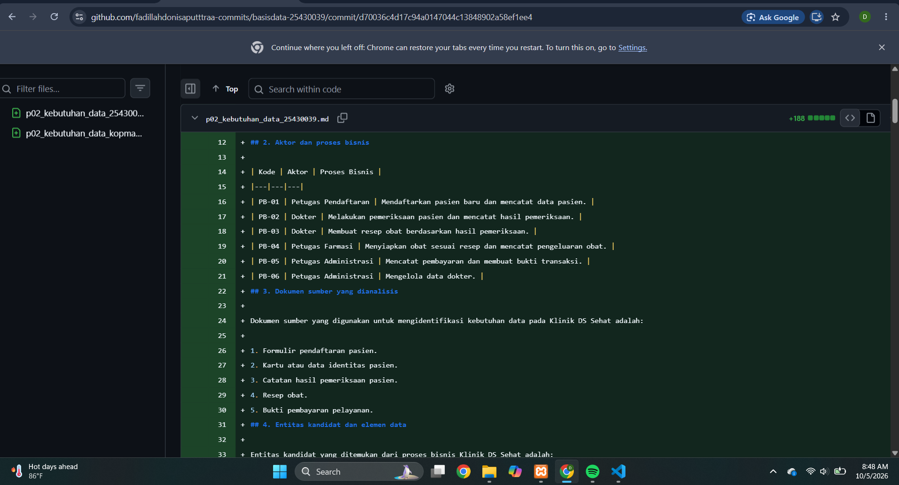
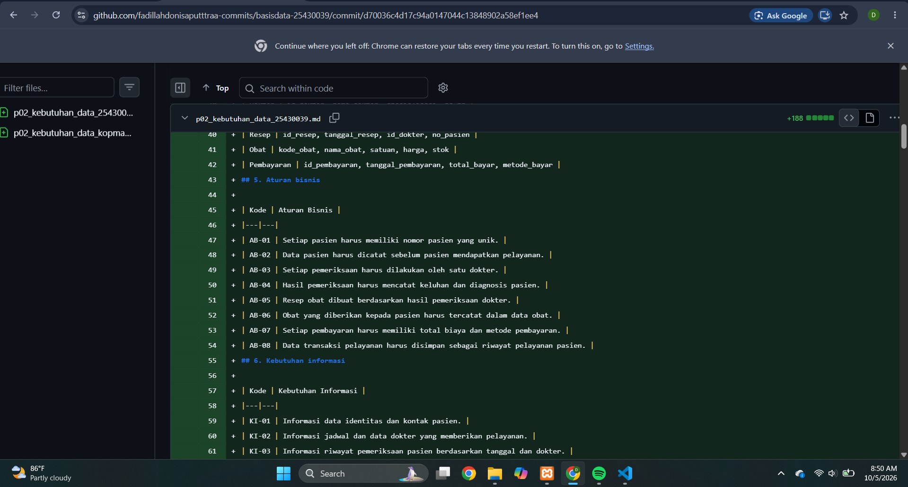
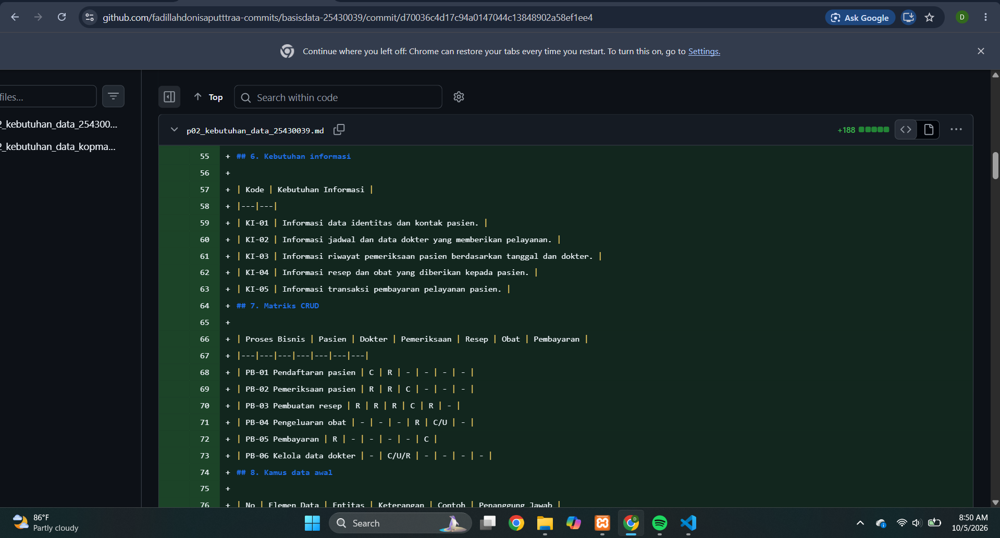
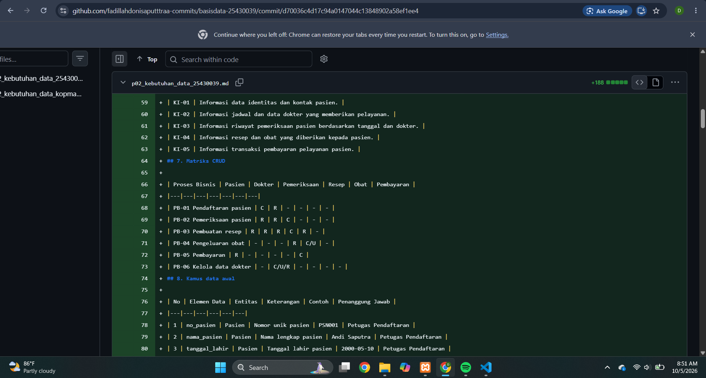
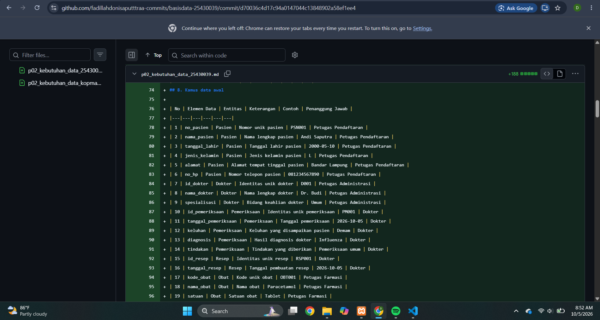
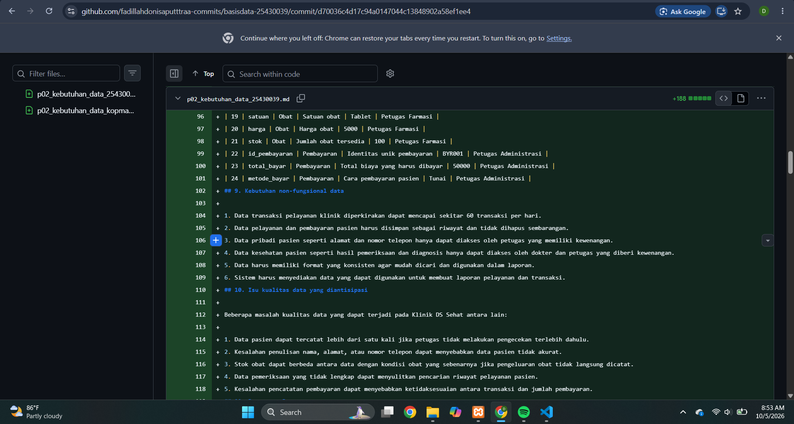

# **MODUL 2 – KEBUTUHAN DATA**

**Nama:** Fadillah Doni Saputra  
**NIM:** 25430039  
**Kelas:** B  
**Mata Kuliah:** Basis Data  
**Pertemuan:** 2  
**Dosen Pengampu:** Dedi Irawan, S.Kom., M.T.I.  
**Tanggal:** 05 Oktober 2026  

---

# **1. Tujuan**

Praktikum Modul 2 bertujuan untuk memahami kebutuhan data sebelum membuat rancangan basis data. Pada praktikum ini dilakukan identifikasi aktor, proses bisnis, entitas, aturan bisnis, kebutuhan informasi, serta hubungan CRUD. Selain itu, dibuat juga kamus data awal dan analisis kebutuhan data untuk proyek Klinik DS Sehat.

---

# **2. Dasar Teori**

Kebutuhan data merupakan tahap awal untuk menentukan data apa saja yang diperlukan oleh suatu organisasi atau sistem. Kebutuhan data dapat diperoleh dengan melihat aktivitas organisasi, aktor yang terlibat, dokumen yang digunakan, serta aturan bisnis yang berlaku.

Dalam analisis kebutuhan data terdapat beberapa bagian penting, yaitu proses bisnis, entitas, aturan bisnis, kebutuhan informasi, matriks CRUD, dan kamus data. Proses bisnis menjelaskan kegiatan yang dilakukan oleh aktor, sedangkan entitas merupakan objek atau kejadian yang datanya perlu disimpan.

Matriks CRUD digunakan untuk melihat proses yang melakukan Create, Read, Update, atau Delete terhadap suatu entitas. Kamus data digunakan untuk menjelaskan elemen data yang digunakan dalam sistem, termasuk sumber dan penanggung jawabnya.

---

# **3. Hasil Praktikum**

## **3.1 Aktor dan Proses Bisnis**

Pada proyek Klinik DS Sehat terdapat beberapa aktor yang terlibat dalam kegiatan pelayanan, yaitu Petugas Pendaftaran, Dokter, Petugas Farmasi, dan Petugas Administrasi.

Proses bisnis yang berhasil diidentifikasi antara lain:

- PB-01: Petugas Pendaftaran mendaftarkan pasien baru dan mencatat data pasien.
- PB-02: Dokter melakukan pemeriksaan pasien dan mencatat hasil pemeriksaan.
- PB-03: Dokter membuat resep obat berdasarkan hasil pemeriksaan.
- PB-04: Petugas Farmasi menyiapkan obat sesuai resep dan mencatat pengeluaran obat.
- PB-05: Petugas Administrasi mencatat pembayaran dan membuat bukti transaksi.
- PB-06: Petugas Administrasi mengelola data dokter.

**Bukti tampilan GitHub:**

**Gambar 1. Aktor dan Proses Bisnis**

---

## **3.2 Aturan Bisnis**

Aturan bisnis digunakan sebagai dasar dalam menentukan bagaimana data harus dicatat dan digunakan. Aturan bisnis pada Klinik DS Sehat antara lain:

- AB-01: Setiap pasien harus memiliki nomor pasien yang unik.
- AB-02: Data pasien harus dicatat sebelum pasien mendapatkan pelayanan.
- AB-03: Setiap pemeriksaan harus dilakukan oleh satu dokter.
- AB-04: Hasil pemeriksaan harus mencatat keluhan dan diagnosis pasien.
- AB-05: Resep obat dibuat berdasarkan hasil pemeriksaan dokter.
- AB-06: Obat yang diberikan kepada pasien harus tercatat dalam data obat.
- AB-07: Setiap pembayaran harus memiliki total biaya dan metode pembayaran.
- AB-08: Data transaksi pelayanan harus disimpan sebagai riwayat pelayanan pasien.

**Bukti tampilan GitHub:**

**Gambar 2. Aturan Bisnis**

---

## **3.3 Kebutuhan Informasi**

Kebutuhan informasi yang diperoleh dari proses bisnis Klinik DS Sehat adalah:

- KI-01: Informasi data identitas dan kontak pasien.
- KI-02: Informasi jadwal dan data dokter yang memberikan pelayanan.
- KI-03: Informasi riwayat pemeriksaan pasien berdasarkan tanggal dan dokter.
- KI-04: Informasi resep dan obat yang diberikan kepada pasien.
- KI-05: Informasi transaksi pembayaran pelayanan pasien.

**Bukti tampilan GitHub:**

**Gambar 3. Kebutuhan Informasi**

---

## **3.4 Matriks CRUD**

Matriks CRUD digunakan untuk mengetahui aktivitas yang dilakukan setiap proses bisnis terhadap entitas.

| Proses Bisnis | Pasien | Dokter | Pemeriksaan | Resep | Obat | Pembayaran |
|---|---|---|---|---|---|---|
| PB-01 Pendaftaran pasien | C | - | - | - | - | - |
| PB-02 Pemeriksaan pasien | R | R | C | - | - | - |
| PB-03 Pembuatan resep | R | R | R | C | R | - |
| PB-04 Pengeluaran obat | - | - | - | R | C/U | - |
| PB-05 Pembayaran | R | - | - | - | - | C |
| PB-06 Kelola data dokter | - | C/U/R | - | - | - | - |

Dari matriks tersebut dapat diketahui bahwa setiap entitas digunakan oleh proses bisnis yang sesuai. Contohnya, entitas Pasien dibuat pada proses pendaftaran dan dibaca pada proses pemeriksaan serta pembayaran.

**Bukti tampilan GitHub:**

**Gambar 4. Matriks CRUD**

---

## **3.5 Kamus Data**

Kamus data awal dibuat untuk menjelaskan elemen-elemen data yang digunakan dalam sistem Klinik DS Sehat.

| No | Elemen Data | Entitas | Keterangan | Penanggung Jawab |
|---|---|---|---|---|
| 1 | no_pasien | Pasien | Nomor unik pasien | Petugas Pendaftaran |
| 2 | nama_pasien | Pasien | Nama lengkap pasien | Petugas Pendaftaran |
| 3 | tanggal_lahir | Pasien | Tanggal lahir pasien | Petugas Pendaftaran |
| 4 | jenis_kelamin | Pasien | Jenis kelamin pasien | Petugas Pendaftaran |
| 5 | alamat | Pasien | Alamat tempat tinggal | Petugas Pendaftaran |
| 6 | no_hp | Pasien | Nomor telepon pasien | Petugas Pendaftaran |
| 7 | id_dokter | Dokter | Identitas unik dokter | Petugas Administrasi |
| 8 | nama_dokter | Dokter | Nama lengkap dokter | Petugas Administrasi |
| 9 | spesialisasi | Dokter | Bidang keahlian dokter | Petugas Administrasi |
| 10 | id_pemeriksaan | Pemeriksaan | Identitas pemeriksaan | Dokter |
| 11 | tanggal_pemeriksaan | Pemeriksaan | Tanggal pemeriksaan | Dokter |
| 12 | keluhan | Pemeriksaan | Keluhan pasien | Dokter |
| 13 | diagnosis | Pemeriksaan | Hasil diagnosis | Dokter |
| 14 | tindakan | Pemeriksaan | Tindakan yang diberikan | Dokter |
| 15 | id_resep | Resep | Identitas resep | Dokter |
| 16 | tanggal_resep | Resep | Tanggal pembuatan resep | Dokter |
| 17 | kode_obat | Obat | Kode unik obat | Petugas Farmasi |
| 18 | nama_obat | Obat | Nama obat | Petugas Farmasi |
| 19 | satuan | Obat | Satuan obat | Petugas Farmasi |
| 20 | harga | Obat | Harga obat | Petugas Farmasi |
| 21 | stok | Obat | Jumlah obat tersedia | Petugas Farmasi |
| 22 | id_pembayaran | Pembayaran | Identitas pembayaran | Petugas Administrasi |
| 23 | total_bayar | Pembayaran | Total biaya pelayanan | Petugas Administrasi |
| 24 | metode_bayar | Pembayaran | Cara pembayaran | Petugas Administrasi |

**Bukti tampilan GitHub:**

**Gambar 5. Kamus Data Awal**

---

# **4. Analisis Titik Analisis 1–3**

## **4.1 Titik Analisis 1 – Kebutuhan Terlalu Umum**

Kebutuhan data tidak cukup hanya ditulis secara umum. Contohnya adalah "data pasien". Kebutuhan tersebut masih terlalu luas karena belum menjelaskan data apa saja yang diperlukan.

Pada Klinik DS Sehat, kebutuhan tersebut dijabarkan menjadi beberapa elemen seperti no_pasien, nama_pasien, tanggal_lahir, jenis_kelamin, alamat, dan no_hp.

Dengan cara tersebut, kebutuhan dapat diterjemahkan menjadi struktur data yang lebih jelas dan dapat diuji.

## **4.2 Titik Analisis 2 – Proses dan Entitas**

Proses bisnis merupakan kegiatan yang dilakukan oleh aktor, sedangkan entitas merupakan objek atau kejadian yang datanya dicatat.

Contohnya, "pendaftaran pasien" merupakan proses bisnis, sedangkan "Pasien" merupakan entitas. Pemisahan ini diperlukan agar proses bisnis dan entitas tidak tertukar pada tahap perancangan basis data.

## **4.3 Titik Analisis 3 – Pemeriksaan Matriks CRUD**

Matriks CRUD digunakan untuk memeriksa apakah entitas sudah digunakan oleh proses bisnis yang sesuai.

Jika terdapat entitas yang tidak memiliki aktivitas Create atau tidak digunakan oleh proses tertentu, maka entitas tersebut perlu diperiksa kembali. Entitas tersebut mungkin membutuhkan proses pemeliharaan atau sebenarnya tidak diperlukan.

Pada Klinik DS Sehat, setiap entitas telah dihubungkan dengan proses bisnis yang relevan.

---

# **5. Perhitungan Parameter P**

Parameter P dihitung menggunakan dua digit terakhir NIM.

Dua digit terakhir NIM = 39.

Rumus:

**P = (39 mod 9) + 1**

**P = 3 + 1**

**P = 4**

Berdasarkan nilai P = 4, diperoleh:

- Batas maksimal item per transaksi = P + 2 = **6 item**.
- Persentase diskon atau denda harian = **4**.
- Perkiraan volume transaksi harian = 40 + (5 × P) = **60 transaksi per hari**.

Nilai tersebut digunakan sebagai parameter dalam kebutuhan data proyek.

---

# **6. Perbaikan Pernyataan Kebutuhan yang Kabur**

## **6.1 Data Pasien Harus Aman**

**Pernyataan awal:**  
Data pasien harus aman.

**Perbaikan:**  
Data pribadi pasien seperti alamat dan nomor telepon hanya dapat diakses oleh petugas yang memiliki kewenangan. Data pemeriksaan pasien hanya dapat diakses oleh dokter dan petugas yang diberi hak akses.

## **6.2 Sistem Harus Cepat Mencari Data Pasien**

**Pernyataan awal:**  
Sistem harus cepat mencari data pasien.

**Perbaikan:**  
Pencarian data pasien berdasarkan nomor pasien atau nama pasien harus menampilkan hasil yang sesuai sehingga petugas dapat menemukan data pasien dengan cepat.

## **6.3 Laporan Pelayanan Harus Akurat**

**Pernyataan awal:**  
Laporan pelayanan harus akurat.

**Perbaikan:**  
Laporan pelayanan harus menggunakan data pemeriksaan dan pembayaran yang tercatat pada transaksi sehingga jumlah pelayanan dan total pembayaran dapat dicocokkan dengan data sumber.

---

# **7. Latihan Kopma – Poin Loyalitas**

Selain proyek Klinik DS Sehat, dilakukan latihan kebutuhan data pada Koperasi Mahasiswa (Kopma).

Ketentuan latihan adalah setiap pembelian sebesar Rp10.000 mendapatkan 1 poin. Apabila anggota memiliki 50 poin, poin tersebut dapat digunakan untuk mendapatkan potongan Rp5.000.

## **7.1 Elemen Data Tambahan**

Elemen data yang diperlukan antara lain:

- poin_anggota
- poin_diperoleh
- poin_digunakan
- diskon_poin

## **7.2 Aturan Bisnis Tambahan**

- AB-07: Setiap pembelian Rp10.000 memberikan 1 poin.
- AB-08: Poin yang diperoleh ditambahkan ke saldo poin anggota.
- AB-09: Setiap 50 poin dapat ditukar dengan diskon Rp5.000.
- AB-10: Poin yang digunakan untuk penukaran harus dikurangi dari saldo poin anggota.

## **7.3 Kebutuhan Informasi**

Kebutuhan informasi tambahan:

- KI-06: Informasi jumlah poin anggota.
- KI-07: Informasi poin yang diperoleh dari setiap transaksi.
- KI-08: Informasi riwayat penggunaan poin dan diskon yang diperoleh.

CRUD pada proses bisnis juga perlu diperbarui agar data poin dapat dikelola dalam proses yang berkaitan dengan anggota dan transaksi.

---

# **8. Dokumen Sumber Fiktif**

Salah satu dokumen sumber yang dibuat untuk proyek Klinik DS Sehat adalah **Formulir Pendaftaran Pasien**.

Formulir ini digunakan oleh petugas pendaftaran untuk mencatat data awal pasien sebelum mendapatkan pelayanan.

Elemen data yang diperoleh dari formulir tersebut adalah:

| Elemen Data | Sumber | Entitas Tujuan |
|---|---|---|
| no_pasien | Nomor pasien | Pasien |
| nama_pasien | Nama pasien | Pasien |
| tanggal_lahir | Tanggal lahir | Pasien |
| jenis_kelamin | Jenis kelamin | Pasien |
| alamat | Alamat pasien | Pasien |
| no_hp | Nomor telepon | Pasien |

Dokumen tersebut membantu menentukan elemen data yang perlu disimpan pada entitas Pasien.

---

# **9. Milestone Proyek 2**

Pada Milestone Proyek 2 telah dibuat dokumen:

`p02_kebutuhan_data_25430039.md`

Dokumen tersebut berisi kebutuhan data untuk proyek Klinik DS Sehat.

Hasil yang telah dibuat meliputi:

- 6 proses bisnis.
- 6 entitas kandidat.
- 8 aturan bisnis.
- 5 kebutuhan informasi.
- Matriks CRUD.
- Kamus data awal sebanyak 24 elemen.
- Kebutuhan non-fungsional data.
- Isu kualitas data.
- Perhitungan parameter P.
- Perbaikan kebutuhan yang masih bersifat umum.
- Dokumen sumber fiktif berupa formulir pendaftaran pasien.

Selain dokumen proyek, dibuat juga:

`p02_kebutuhan_data_kopma_25430039.md`

yang berisi latihan kebutuhan data Kopma dan aturan poin loyalitas.

---

# **10. Pembahasan**

Pada praktikum Modul 2, saya mempelajari bahwa sebelum membuat tabel database, kebutuhan data harus dianalisis terlebih dahulu. Dari proses bisnis yang ada, dapat ditentukan aktor, entitas, aturan bisnis, serta informasi yang dibutuhkan.

Kesulitan yang ditemui adalah menentukan perbedaan antara proses bisnis dan entitas serta menentukan hubungan CRUD yang sesuai. Setelah proses bisnis dan entitas dipisahkan, penyusunan matriks CRUD menjadi lebih mudah.

Pembuatan kamus data juga membantu dalam menentukan data apa saja yang benar-benar diperlukan. Dengan adanya penanggung jawab pada setiap elemen data, sumber dan pengelolaan data menjadi lebih jelas.

Pada proyek Klinik DS Sehat, data pasien dan data pemeriksaan termasuk data yang perlu diperhatikan karena berhubungan dengan informasi pribadi pasien. Oleh karena itu, akses terhadap data tersebut perlu dibatasi sesuai kewenangan.

---

# **11. Pernyataan Penggunaan AI**

Dalam pengerjaan laporan dan analisis Modul 2, AI digunakan sebagai alat bantu untuk memahami materi, membantu menyusun kalimat, dan mengecek struktur penulisan. Data proyek, nama objek, proses bisnis, serta keputusan kebutuhan data disesuaikan dengan hasil pengerjaan praktikum.

AI tidak digunakan sebagai pengganti proses praktikum. Hasil akhir tetap diperiksa dan disesuaikan dengan pekerjaan yang dilakukan pada praktikum.

---

# **12. Bukti Git**

Dokumen Modul 2 dan screenshot telah dimasukkan ke repository GitHub:

`basisdata-25430039`

Screenshot kebutuhan data disimpan pada folder:

`SS/`

Commit dokumen kebutuhan data:

`d70036c` — `p02: dokumen kebutuhan data`

Commit screenshot:

`590b421` — `p02: tambah screenshot kebutuhan data`

Repository digunakan sebagai bukti penyimpanan dan pengumpulan hasil praktikum.

---

# **13. Kesimpulan**

Pada Modul 2 telah dilakukan analisis kebutuhan data untuk proyek Klinik DS Sehat. Hasil analisis meliputi proses bisnis, entitas, aturan bisnis, kebutuhan informasi, matriks CRUD, dan kamus data awal. Selain itu, telah dilakukan perhitungan parameter P dan perbaikan kebutuhan yang masih terlalu umum.

Dari praktikum ini dapat dipahami bahwa analisis kebutuhan data diperlukan agar rancangan basis data yang dibuat sesuai dengan proses bisnis dan kebutuhan informasi organisasi.